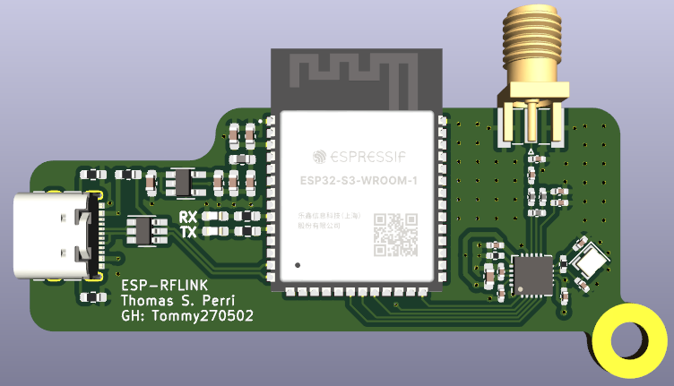

# Wireless Dev Bridge

Wireless Dev Bridge is a USB-C developer kit for ESP32-S3 and nRF24L01+ work. It gives one bench dongle a shared JSON command protocol over USB serial, HTTP, WebSocket, and BLE, plus a Python SDK, CLI, desktop workbench, embedded browser dashboard, KiCad hardware source, and manufacturing outputs.



## Start Here

1. Read [Getting Started](docs/getting-started.md) for firmware build, SDK install, and first RF validation.
2. Use the desktop workbench:

   ```bash
   python application/main.py
   ```

3. Or install the SDK and CLI:

   ```bash
   cd sdk/python
   python -m pip install -e ".[all]"
   wdb discover
   wdb --serial COM5 identify
   wdb --serial COM5 diagnostics
   ```

4. For a two-dongle kit, flash one `node1` and one `node2`, then run:

   ```bash
   wdb pair-test --node1-serial COM5 --node2-serial COM6
   ```

## Product Surfaces

- Firmware: PlatformIO ESP32-S3 firmware in `Firmware/ESP32_RFLINK`.
- Desktop app: Tkinter workbench in `application`.
- SDK/CLI: Python package in `sdk/python`.
- Browser dashboard: served by the dongle SoftAP at `http://192.168.4.1`.
- Hardware: KiCad source in `hardware/kicad`.
- Manufacturing: current V1 Gerber/drill export in `manufacturing/gerbers`.

## V1.1 Capabilities

- Shared command envelope over USB serial, HTTP, WebSocket, and BLE.
- Runtime RF config, address management, send/listen/flush, and bridge toggles.
- Settings persistence through NVS with `settings_get`, `settings_set`, `settings_save`, and `settings_reset`.
- Diagnostics and identify commands for support and physical device matching.
- Optional token auth for HTTP, WebSocket, and BLE command surfaces.
- Support report export from the CLI and desktop workbench.

## Development Checks

```bash
cd Firmware/ESP32_RFLINK
pio run -e node1 -e node2

cd ../../sdk/python
python -m pytest

cd ../..
python -m py_compile application/main.py
```

## Documentation

- [Documentation Index](docs/documentation-index.md)
- [First Run](docs/first-run.md)
- [API Reference](docs/api-reference.md)
- [Security Model](docs/security-model.md)
- [Troubleshooting](docs/troubleshooting.md)
- [Release Checklist](docs/release-checklist.md)

## License

Software is licensed under the MIT License; see [LICENSE](LICENSE). Hardware source and manufacturing outputs use the hardware license notice in [hardware/LICENSE.md](hardware/LICENSE.md).
