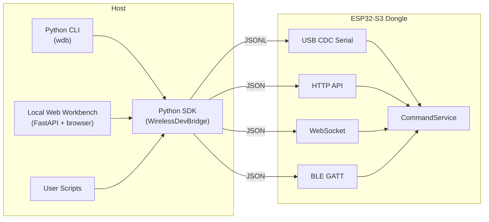
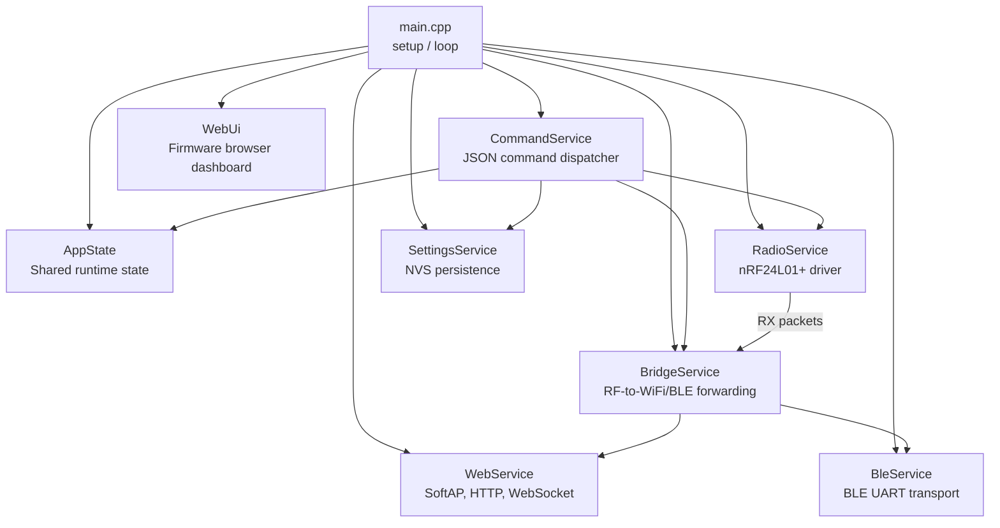
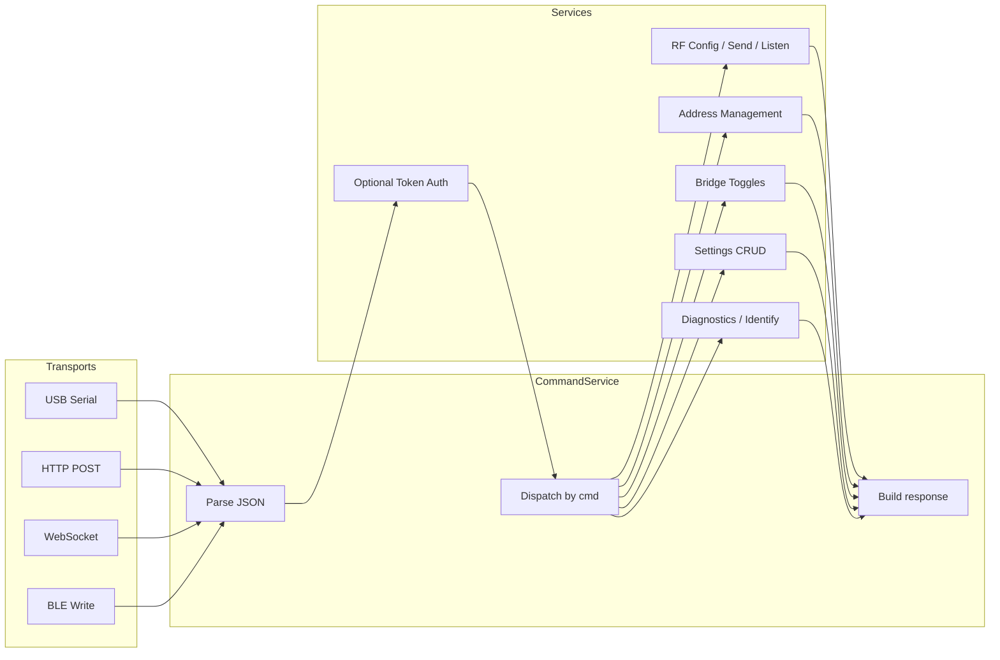
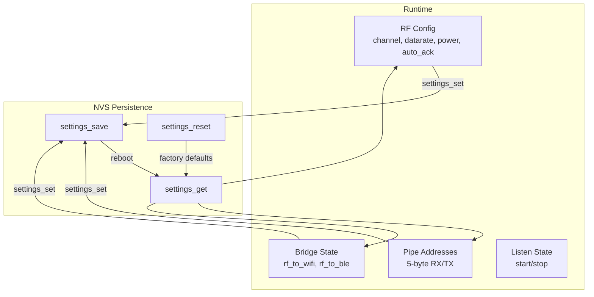
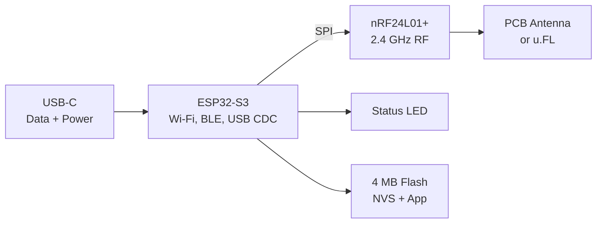

# Architecture

System architecture for Wireless Dev Bridge V1.

## Host Tools And Transports



## Firmware Module Structure



## Command Layer

All transports share one command request/response envelope:

```
Request:  {"cmd":"<name>", ...params}
Response: {"ok":true|false, "cmd":"<name>", "data":{...}, "error":null|"..."}
```



## RF And Settings Services



## Hardware Block Diagram


