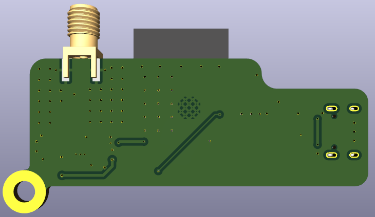

# Hardware Guide

The hardware source is a KiCad project for the ESP32-S3 and nRF24L01+ USB-C developer dongle.

## Board Assets

Top view:


Bottom view:



## Paths

| Path | Purpose |
| --- | --- |
| `hardware/kicad/ESPxRF.kicad_pro` | KiCad project entry point. |
| `hardware/kicad/ESPxRF.kicad_sch` | Schematic source. |
| `hardware/kicad/ESPxRF.kicad_pcb` | PCB layout source. |
| `hardware/BOM.md` | BOM release checklist and sourcing notes. |
| `hardware/ASSEMBLY.md` | Assembly and bring-up notes. |
| `hardware/BOARD_REVISION.md` | Board revision notes. |
| `hardware/PINOUT.md` | Pinout card for firmware/hardware alignment. |
| `manufacturing/gerbers` | Current Gerber and drill export. |

## Opening In KiCad

Open:

```text
hardware/kicad/ESPxRF.kicad_pro
```

The tracked KiCad files should not depend on user-local absolute paths. Standard component 3D models reference KiCad library variables where available. No project-local 3D model bundle is currently tracked in this repository.

## Manufacturing Outputs

The current generated manufacturing files are in:

```text
manufacturing/gerbers
```

Before ordering boards for a public release:

- Re-run KiCad DRC/ERC in the KiCad version used for release.
- Inspect copper, solder mask, paste, silkscreen, edge cuts, and drills in a Gerber viewer.
- Confirm stackup, board thickness, copper weight, impedance expectations, and RF connector footprint requirements with the fab.
- Generate a fresh fab package from `hardware/kicad/ESPxRF.kicad_pcb` if the layout changes.

## Firmware Pin Alignment

The firmware pin map is kept in:

```text
Firmware/ESP32_RFLINK/include/Config.h
```

Any PCB routing change that affects the nRF24 SPI bus, CE/CSN, or LEDs must be reflected there before releasing firmware.

## Verification Status

**Verified through design review:**

- Schematic captures ESP32-S3, nRF24L01+, USB-C, and status LED connections.
- PCB layout generated Gerber/drill output in `manufacturing/gerbers`.
- Firmware pin map in `Config.h` aligns with schematic net names.
- BOM components are sourced from standard distributors.

**Requires hardware validation:**

- PCB fabrication and assembly from the current Gerber export.
- nRF24L01+ SPI communication on the production board.
- USB-C enumeration and CDC serial on the production board.
- RF range and reliability testing with production antennas.
- Thermal behavior under sustained TX/RX workloads.
- ESD and EMC compliance if applicable to the deployment environment.
